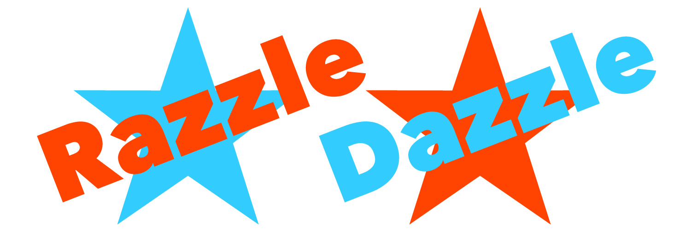
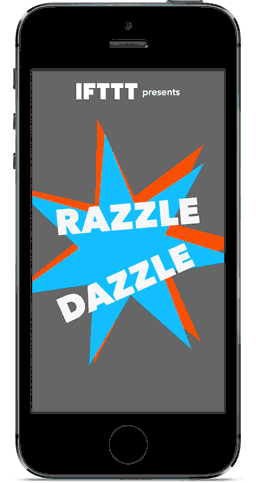

[](http://ifttt.github.io)



[](https://github.com/Carthage/Carthage) [](http://cocoadocs.org/docsets/RazzleDazzle)

`RazzleDazzle` is a simple AutoLayout-friendly keyframe animation framework for iOS, written in Swift. Perfect for scrolling app intros.



`RazzleDazzle	` grew from [`JazzHands`](https://github.com/IFTTT/JazzHands), an Objective-C scrolling keyframe animations library by IFTTT.

[`JazzHands`](https://github.com/IFTTT/JazzHands) is used extensively in [IF and DO for iPhone and iPad](https://ifttt.com/products), most famously in the app intro.

## What's `RazzleDazzle` for?
### Scrolling App Intro Animations
`RazzleDazzle` is the easiest way to add scrollview-powered animations to the app intro of your Swift app. If you're adding a scrolling intro to your Objective-C app, check out [`JazzHands`](https://github.com/IFTTT/JazzHands)!

For some examples of how [`JazzHands`](https://github.com/IFTTT/JazzHands) and `RazzleDazzle` can be used in practice, check out the intros of both [IF and DO for iPhone and iPad](https://ifttt.com/products), as well as the scrolling animations of the buttons in the DO apps by IFTTT.

### Easy Paging Scrollview Layouts in an AutoLayout World
`RazzleDazzle`'s `keep(view: onPage:)` function of the `AnimatedPagingScrollViewController` is a super easy way to lay out a paging scroll view that does what you expect it to when your app is rotated or used in the new split-screen iPad views of iOS9, a notoriously tricky aspect of getting your apps fully AutoLayout-ready. `RazzleDazzle` sets up an AutoLayout-friendly paging scroll view controller for you, and all you need to do to make your layout respond properly to any view size changes is tell `RazzleDazzle` which page you'd like things on.

As a bonus, because it's built on top of the animations library, you can even tell `RazzleDazzle` that you'd like one of your views to show up on multiple pages while other views scroll past, with a single call to `keep(view: onPages:)`.

## Installation

### Carthage

`RazzleDazzle` is available through [Carthage](https://github.com/Carthage/Carthage). To install
it, simply add the following line to your `Cartfile`:

```
github "IFTTT/RazzleDazzle"
```

### CocoaPods

`RazzleDazzle` is also available through [CocoaPods](http://cocoapods.org). To install
it, simply add the following line to your `Podfile`:

```
pod "RazzleDazzle"
```
Because `RazzleDazzle` is written in Swift, be sure to add `use_frameworks!` at the top of your Podfile.

```
source 'https://github.com/CocoaPods/Specs.git'
platform :ios, '8.0'
use_frameworks!

pod 'RazzleDazzle'
```

## Demo App

Open `Example/RazzleDazzle.xcworkspace` and run `RazzleDazzleDemo` to see a simple demonstration of moving, scaling, fading, and transforming views in a scrolling app intro.

## Usage

### Animated Paging Scroll Views
First, import `RazzleDazzle` into your view controller, and subclass `AnimatedPagingScrollViewController`.

```objc
import RazzleDazzle

class ViewController: AnimatedPagingScrollViewController {
```

Tell the paging scroll view controller how many pages it should have.

```objc
override func numberOfPages() -> Int {
	return 4
}
```

Add any views you want to animate to the scrollview's `contentView` on `viewDidLoad`.

```objc
override func viewDidLoad() {
	super.viewDidLoad()
	contentView.addSubview(firstLabel)
}
```

Add your desired vertical position and size constraints to your views.

```objc
contentView.addConstraint(NSLayoutConstraint(item: firstLabel, attribute: .CenterY, relatedBy: .Equal, toItem: contentView, attribute: .CenterY, multiplier: 1, constant: 0))
```

Tell the animated paging scroll view controller to keep the view on the page you want it to stay on.

```objc
keepView(firstLabel, onPage: 1)
```

You can even tell the animated paging scroll view controller to keep the view still on more than one page, while other views scroll past it.

```objc
keepView(firstLabel, onPages: [1,2])
```

Or offset the view's center from the page's center:

```objc
keepView(firstLabel, onPage: 1.25)
```

Just make sure that if you're using any of the `keepView` functions that you don't set an x-position `NSLayoutConstraint` on the view, as it will conflict with the animated x-position constraints generated by `RazzleDazzle`.

### RazzleDazzle Animations
Generally, creating animations in `RazzleDazzle` works similarly to creating animations in `JazzHands`. First, import `RazzleDazzle` into your view controller.

```objc
import RazzleDazzle
```

Then, create an Animator to manage all of the animations in this `UIViewController`.

```objc
var animator = Animator()
```

Create an animation for a view that you want to animate. There are multiple types of animation that can be applied to a view. For this example, we'll use `AlphaAnimation`, which fades a view in and out.

```objc
let alphaAnimation = AlphaAnimation(view: viewThatYouWantToAnimate)
```

Register the animation with the animator.

```objc
animator.addAnimation(alphaAnimation)
```

Add some keyframes to the animation. Let's fade this view out between times 30 and 60.

```objc
alphaAnimation[30] = 1
alphaAnimation[60] = 0
```

Now, to animate the view, tell the animator what time it is. For example, to tie this animation to a UIScrollView, notify the animator of time in the scroller's delegate method.

```objc
func scrollViewDidScroll(scrollView: UIScrollView) {
	animator.animate(scrollView.contentOffset.x)
}
```

This will produce an effect where the view will be fully faded in and visible for scroll positions 0 to 30. Between scroll positions 30 and 60, the view will fade out to be invisible, and it will stay faded out for scroll positions greater than 60.

## Animation Types

`RazzleDazzle` supports several types of animations:

* **AlphaAnimation** animates the `alpha` property _(creates fade effects)_.
* **BackgroundColorAnimation** animates the `backgroundColor` property.
* **RotationAnimation** animates a rotation transform _(for rotation effects)_.
* **ScaleAnimation** applies a scaling transform _(to scale view sizes)_.
* **TranslationAnimation** applies a translation transform _(to translate view position)_.
* **CornerRadiusAnimation** animates the `layer.cornerRadius` property.
* **HideAnimation** animates the `hidden` property _(hides and shows views)_.
* **LayerStrokeStartAnimation** animates the `strokeStart` property of a `CAShapeLayer` _(does not work with LayerStrokeEndAnimation)_.
* **LayerStrokeEndAnimation** animates the `strokeEnd` property of a `CAShapeLayer` _(does not work with LayerStrokeStartAnimation)_.
* **LayerFillColorAnimation** animates the `fillColor` property of a `CAShapeLayer`.
* **LayerStrokeColorAnimation** animates the `strokeColor` property of a `CAShapeLayer`.
* **PathPositionAnimation** animates the `layer.position` property of a `UIView` along a path.
* **LabelTextColorAnimation** animates the `textColor` property of a `UILabel`.
* **ConstraintConstantAnimation** animates an `AutoLayout` constraint constant.
* **ConstraintMultiplierAnimation** animates an `AutoLayout` constraint constant as a multiple of an attribute of another view _(to offset or resize views based on another view's size)_
* **ScrollViewPageConstraintAnimation** animates an `AutoLayout` constraint constant to place a view on a scroll view page _(to position views on a scrollView using AutoLayout)_. This is the animation doing the heavy lifting for `AnimatedPagingScrollViewController`'s `keepView(view: onPage:)` function.

## Creating Custom Animation Types

`RazzleDazzle` is easy to extend by creating your own custom animation types!

### Custom Animation Types

To create your own custom animation type, your type needs to conform to the `Animatable` protocol. All this requires is that you implement an `animate(time:)` function that takes a `CGFloat` time value and does something with it.

For most custom animations, you'll want to subclass `Animation` with the specific type of the property you want to interpolate for each keyframe.

```objc
public class BorderWidthAnimation : Animation<CGFloat>, Animatable {
```

Create a property to store whatever view (or other object) you are applying the animations to, and create an initializer that takes a view as input.

```objc
private let view : UIView

public init(view: UIView) {
	self.view = view
}
```

Optionally, you can add a function to validate any input values that will be checked each time a keyframe is added, such as for Alpha values that must range from 0 to 1.

```objc
public override func validateValue(value: CGFloat) -> Bool {
	return (value >= 0) && (value <= 1)
}
```

Then, all you need to do is to make the appropriate changes to your view when the `animate(time:)` function is called.

```objc
public func animate(time: CGFloat) {
	if !hasKeyframes() {return}
	view.layer.borderWidth = self[time]
}
```

You can then create an instance of your new Animation in your `UIViewController`, give it the view you'd like to animate, add it to your Animator and set some keyframes as above, and it will animate your custom property when the Animator is told to animate.

### Interpolatable Types

`RazzleDazzle` can animate any type that conforms to the `Interpolatable` protocol. It comes pre-cooked to support animating `CGFloats`, `CGPoints`, `CGSizes`, `CGRects`, and `UIColors`.

If the property you'd like to animate is of a different type, just extend that type to conform to `Interpolatable` by adding a static function `interpolateFrom(fromValue: toValue: withProgress:)` that returns an instance of that type between two other instances of the same type.

```objc
extension CGPoint : Interpolatable {
    public static func interpolateFrom(fromValue: CGPoint, to toValue: CGPoint, withProgress progress: CGFloat) -> CGPoint {
        assert((0 <= progress) && (progress <= 1), "Progress must be between 0 and 1")
        let interpolatedX = CGFloat.interpolateFrom(fromValue.x, to: toValue.x, withProgress: progress)
        let interpolatedY = CGFloat.interpolateFrom(fromValue.y, to: toValue.y, withProgress: progress)
        return CGPointMake(interpolatedX, interpolatedY)
    }
}
```

If your property is a `CGFloat` or one of the other built-in interpolatable types, you only need to create an animation type that tells `RazzleDazzle` how to apply the keyframe values to your view, as above.

## Notes

An animator can only handle one animation per type per view. If you want multiple animations of the same type on a view, use keyframes of a single animation instead of two separate animations.

`RazzleDazzle` is written in Swift 2.0, so it will only compile in Xcode 7 and up. If you want to use a library like this that will integrate with an older version of Swift, you can use [`JazzHands`](https://github.com/IFTTT/JazzHands), which is written in Objective-C, and use a bridging header to access the methods from your Swift 1.2 classes.

## Contributors

* [Laura Skelton](https://github.com/lauraskelton), creator.

## Contributing

1. Fork it ( https://github.com/[my-github-username]/RazzleDazzle/fork )
2. Create your feature branch (`git checkout -b my-new-feature`)
3. Commit your changes (`git commit -am 'Add some feature'`)
4. Push to the branch (`git push origin my-new-feature`)
5. Create a new Pull Request

## License

`RazzleDazzle` is available under the MIT license. See the LICENSE file for more info.

Copyright 2015 IFTTT Inc.
